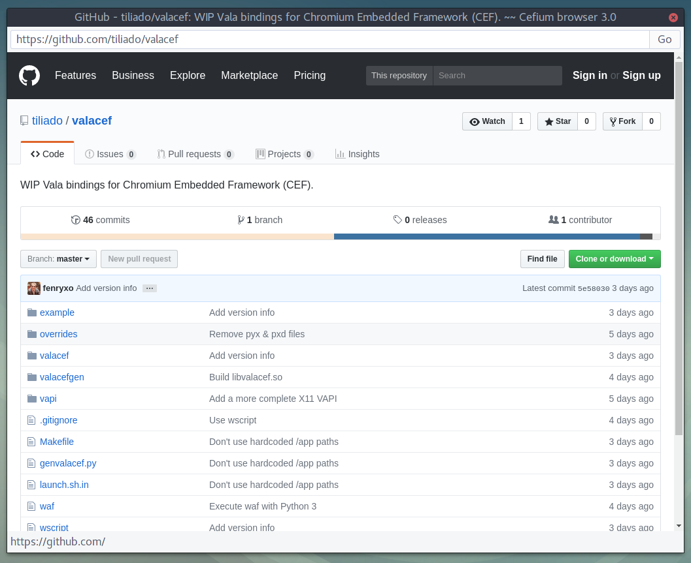

Vala-CEF 76.3809
================

⛔ Deprecated ⛔
----------------

💀 Valacef is deprecated as [I haven't managed to make Nuvola work with Chromium 76 or newer](https://github.com/tiliado/valacef/issues/17).

👉 [The last working branch is 75.3770.x](https://github.com/tiliado/valacef/tree/75.3770.x).

👍 [Nuvola will be ported to QtWebEngine](https://github.com/tiliado/nuvolaruntime/issues/583).

About
-----

**WIP [Vala](https://wiki.gnome.org/Projects/Vala) bindings for
[Chromium Embedded Framework](https://bitbucket.org/chromiumembedded/cef/)**

Components
---------

  * [valacefgen](./valacefgen): Generates Vala bindings for CEF C API from CEF C header files.
  * [valacef](./valacef): Combines generates Vala bindings and extra goodies into a shared library.
  * [valacefgtk](./valacefgtk): High-level GTK+ 3 based API inspired by WebKitGTK+.
  * [cefium](./cefium): A demo web browser based on valacef(gtk).

Dependencies
-----------

  * Python >= 3.6
  * Vala => 0.34.7
  * glib-2.0 >= 2.52.0
  * gtk+-3.0 >= 3.22.0
  * x11
  * CEF 76.3809.x -- see [BUILDING_CEF.md](./BUILDING_CEF.md)

Build Instructions
----------------

  * `./waf --help`
  * `./waf configure`
  * `make run`

Environment variables
---------------------

ValaCEF supports following environment variables for debugging purposes:

  * `VALACEF_FORCE_GPU=yes` - Force GPU rasterization (disables builtin GPU blacklist).
  * `VALACEF_DEFAULT_RENDERING_MODE=offscreen` - Set offscreen rendering as the default rendering mode.

Copyright
--------

  * Copyright 2017-2019 Jiří Janoušek
  * License: [BSD-2-Clause](./LICENSE)

